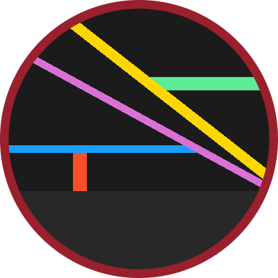

<h1 align="center">
     
    Daybreak Asuna Theme
</h1>

Daybreak Asuna Theme, a complex dark theme for Visual Studio Code.

This theme is a mishmash of [Y-Yss's](https://github.com/Y-Ysss) [Daybreak Theme](https://github.com/Y-Ysss/vscode-daybreak-theme) and [Doki Theme's](https://github.com/doki-theme) [Doki Theme: SAO: Asuna theme](https://github.com/doki-theme/doki-theme-vscode). The base line Theming is from Doki Theme, with added snytax from the Daybreak Theme. The added snytax from Daybreak is there to work with [Y-Yss's](https://github.com/Y-Ysss) [Cisco Config Highlight](https://github.com/Y-Ysss/vscode-cisco-config-highlight) extension. Parts of the Doki Asuna theme was deprecated, do to changes with VS code theming, and was either reformated or removed. Assortments of syntax coloring has been modified away from the defaults of template themes. 